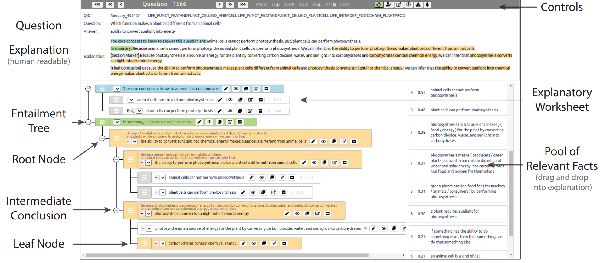

# EntailmentBank Tree-structured Explanation Authoring Tool

This is the repository for the EntailmentBank annotation tool, which allows authoring tree-structured explanations such as those found in EntailmentBank.  For more information, please see the paper [Explaining Answers with Entailment Trees (EMNLP 2021) (PDF)](https://aclanthology.org/2021.emnlp-main.585.pdf).

## Alternate Repositories:
While this repository focuses on the EntailmentBank annotation tool, several other repositories exist for the official dataset, and evaluation code:

**Official Dataset:** The official EntailmentBank dataset is available at: https://allenai.org/data/entailmentbank

**Evaluation Code:** The evaluation code used in the paper is available in this repository: https://github.com/allenai/entailment_bank/

## Annotation Tool Installation Instructions
These installation instructions are intended for Ubuntu 20.04 LTS: 

#### Step 1: Install Yarn:
First, add the repository to apt:

    curl -sS https://dl.yarnpkg.com/debian/pubkey.gpg | sudo apt-key add
    echo "deb https://dl.yarnpkg.com/debian/ stable main" | sudo tee /etc/apt/sources.list.d/yarn.list

Next, update, andinstall `yarn` (which should also install `node.js`):

    sudo apt update
    sudo apt install yarn

You can verify the `yarn` installation:

    > yarn --version
    1.22.15

And also verify the `node.js` installation:

    > node -v
    v10.19.0

#### Step 2: Install NPM:

    sudo apt install npm 
    > npm --version
    6.14.4

#### Step 3: Install json-server:
Note that this tool requires json-server version 0.16.1 :

    sudo ./install-json-server.sh
    > json-server --version
    0.16.1

## Running the server/tool:
The tool is run in a web browser, and has two back-end components that need to be run separately: the json-server (for the database), and the node server back-end (for the tool client):

#### Step 4: In a terminal window, start the `json-server` backend:

    ./start-json-server.sh

#### Step 5: In a separate terminal window, start the `node.js` back-end:

    ./run_tool.sh
This process can take a few moments to complete:
- After 10-20 seconds, the server code will be compiled.  (It may list a number of warnings during this process). 
- After successfully compiling, it typically opens a browser to `localhost:3000`, displaying the user interface.  If it doesn't, open your favorite browser and enter in `localhost:3000`. 

You should see an interface that looks something the interface below. 

----

## Configuration:

#### Ports:
- By default, the tool looks for the json-server to be at `localhost:8000`.  You can change where it looks for this at src/index.js (line 35). 
- Depending on your firewall settings, you may have to open up the ports that the json server and tool server run on.

----

Usage: 

* TODO

----

## Known issues/limitations:
- **Database size:** For simplicity, the back-end database is currently stored as a giant JSON file, and served with `json-server`.  If the file size increases too large, it can crash (around 100MB in our tests, or approximately 4000 questions/trees).  If you need more than this, a low-barrier solution is to consider chunking the files, and only working on one at a given time. 

- **Resistance to web-attacks:** If you choose to run this on a public facing server, you may notice that it regularly comes under attack from bots of various kinds.  The code hasn't been designed to withstand these attacks, and we recommend running it on a server behind a firewall.  While we haven't noticed any data integrity issues from the typical attacks, it does tend to crash the JSON server and/or the tool server, and require restart.

## Questions:
If you have any questions, comments, suggestions, or issues with using this annotation tool, please send a note to **pajansen@email.arizona.edu** . 

## Citation:
If you use this work, please cite: 

[Dalvi et al. (EMNLP 2021). Explaining Answers with Entailment Trees](https://api.semanticscholar.org/CorpusID:233297051)   *(Semantic Scholar)*

    @inproceedings{dalvi-etal-2021-explaining,
        title = "Explaining Answers with Entailment Trees",
        author = "Dalvi, Bhavana  and
          Jansen, Peter  and
          Tafjord, Oyvind  and
          Xie, Zhengnan  and
          Smith, Hannah  and
          Pipatanangkura, Leighanna  and
          Clark, Peter",
        booktitle = "Proceedings of the 2021 Conference on Empirical Methods in Natural Language Processing",
        month = nov,
        year = "2021",
        address = "Online and Punta Cana, Dominican Republic",
        publisher = "Association for Computational Linguistics",
        url = "https://aclanthology.org/2021.emnlp-main.585",
        pages = "7358--7370",
        abstract = "Our goal, in the context of open-domain textual question-answering (QA), is to explain answers by showing the line of reasoning from what is known to the answer, rather than simply showing a fragment of textual evidence (a {``}rationale{''}). If this could be done, new opportunities for understanding and debugging the system{'}s reasoning become possible. Our approach is to generate explanations in the form of entailment trees, namely a tree of multipremise entailment steps from facts that are known, through intermediate conclusions, to the hypothesis of interest (namely the question + answer). To train a model with this skill, we created ENTAILMENTBANK, the first dataset to contain multistep entailment trees. Given a hypothesis (question + answer), we define three increasingly difficult explanation tasks: generate a valid entailment tree given (a) all relevant sentences (b) all relevant and some irrelevant sentences, or (c) a corpus. We show that a strong language model can partially solve these tasks, in particular when the relevant sentences are included in the input (e.g., 35{\%} of trees for (a) are perfect), and with indications of generalization to other domains. This work is significant as it provides a new type of dataset (multistep entailments) and baselines, offering a new avenue for the community to generate richer, more systematic explanations.",
    }

